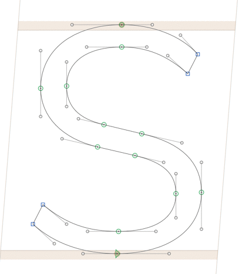

### Alexei's scripts for Glyphs App

---

#### Metrics: 

* **Set Kerning Groups for GF Latin Plus**
→ Derived from @schriftgestalt's [set Kerning Groups][1]. Kerning class declarations have been fully reworked to support [GF Latin Plus][2] and [GF Cyrillic Plus][6] Glyphs Sets. 
 
* **Fix Vertical Metrics**
→ Creates custom parameters in all masters for vertical metrics according to the 125% rule. 

* **Update WinMetrics**
→ Updates `winAscent` and `winDescent` values. Useful for mastering fonts after adding tall glyphs such as Vietnamese. 

* **Inherit Kerning Groups**
→ Inherits Kerning Group to suffixed glyphs (.ssXX) from parent

* **Inherit Metrics Keys**
→ Inherits Metrics Keys to suffixed glyphs (.ssXX) from parent

* **Set Metrics Keys Auto**
→ Sets default Metrics Keys. Derived from `Set Kerning Groups` by @shriftgestalt

* **Steal Metrics Keys**
→ Copies Metrics Keys from other font. Stolen from `Steal kerning groups from font` by @mekkablue

* **Gridster**
→ Opens a new tab with Latin and Cyrillic grid tests.

 
#### Paths: 

* **Slant Rounds**
→ Slants round glyphs with vertical compensation. Based on method by Jacques Le Bailly @fonthausen. Need to specify Italic angle in font master. Use selectively on round glyphs `o c e`, etc,



#### Custom GlyphsData.xml
[GlyphsDataCYR.xml][5] should be placed inside an `Info` folder in the same directory as your .glyphs file:

```
Font Project
|-- Source.glyphs
|-- Info
	|-- GlyphsDataCYR.xml
```

#### Acknowlegements
Mark Foley [@m4rc1e][3], Georg Seifert [@schriftgestalt][4], Rainer Erich Scheichelbauer [@mekkablue][mekkablue]


#### License

Copyright 2016, Alexei Vanyashin @alexeiva

Licensed under the Apache License, Version 2.0 (the "License");
you may not use this file except in compliance with the License.
You may obtain a copy of the License at

    http://www.apache.org/licenses/LICENSE-2.0

Unless required by applicable law or agreed to in writing, software
distributed under the License is distributed on an "AS IS" BASIS,
WITHOUT WARRANTIES OR CONDITIONS OF ANY KIND, either express or implied.
See the License for the specific language governing permissions and
limitations under the License.

[1]: https://github.com/schriftgestalt/Glyphs-Scripts/blob/master/Metrics%20%26%20Classes/set%20Kerning%20Groups.py

[2]: https://github.com/googlefonts/tools/blob/master/encodings/GF%20Glyph%20Sets/GF-latin-plus_unique-glyphs.nam

[3]: https://github.com/m4rc1e/mf-glyphs-scripts

[4]: https://github.com/schriftgestalt/Glyphs-Scripts

[5]: /Info/GlyphDataCYR.xml

[6]: https://github.com/googlefonts/tools/blob/master/encodings/GF%20Glyph%20Sets/Cyrillic/GF-cyrillic-plus_unique-glyphs.nam

[mekkablue]: https://github.com/mekkablue/Glyphs-Scripts